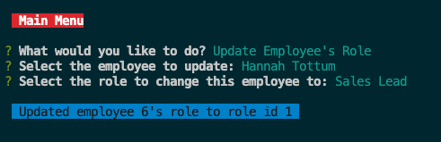

## EMPLOYEE-TRACKER

##  DESCRIPTION
 To create a command-line application using mysql to to be able to view and manage the departments, roles, and employees in a company so that the employer can organize and plan the business.

## INSTALLATION

1.  npm inquirer@8.2.4 
2.  npm mysql2

 ## USAGE

Given a command-line application that accepts user input.

When you start the application,Then you are presented with the following options: view all departments, view all roles, view all employees, add a department, add a role, add an employee, and update an employee role.

When you choose to view all departments,Then you are presented with a formatted table showing department names and department ids.

When you  choose to view all roles,Then you are presented with the job title, role id, the department that role belongs to, and the salary for that role.

When you choose to view all employees,Then you are presented with a formatted table showing employee data, including employee ids, first names, last names, job titles, departments, salaries, and managers that the employees report to.

When you  choose to add a department,Then you are prompted to enter the name of the department and that department is added to the database.

When you choose to add a role,Then you are prompted to enter the name, salary, and department for the role and that role is added to the database.

When you choose to add an employee,Then you are prompted to enter the employee’s first name, last name, role, and manager, and that employee is added to the database.

When you choose to update an employee role,Then you are prompted to select an employee to update and their new role and this information is updated in the database.

## TESTING

1. mysql -u root command is used to open mysql, then source db/schema.sql is used to test the schema file.

2. source db/seeds.sql command is used to add data to the schema file.

3. node server.js command is used to test the application.

## SCREENSHOTS

MAIN MENU 

VIEW ALL DEPARTMENTS 

VIEW ALL ROLES

VIEW ALL EMPLOYEES

ADD A ROLE

ADD A EMPLOYEE

UPDATE A EMPLOYEE ROLE

## WALKTHROUGH VIDEO

https://github.com/priyankav89/employee-tracker/assets/127457597/c30609e6-0e83-41c8-a914-4c2a6d6c63f5

## TECHNOLOGY USED

1. MySql
2. Inquirer
3. Node.js

## CREDITS

 REFERENCES :

1. [MySql](https://www.mysql.com/)
2. [Node.js](https://nodejs.org/en/docs)
3. [Inquirer](https://www.npmjs.com/package/inquirer)

## LICENSE 

